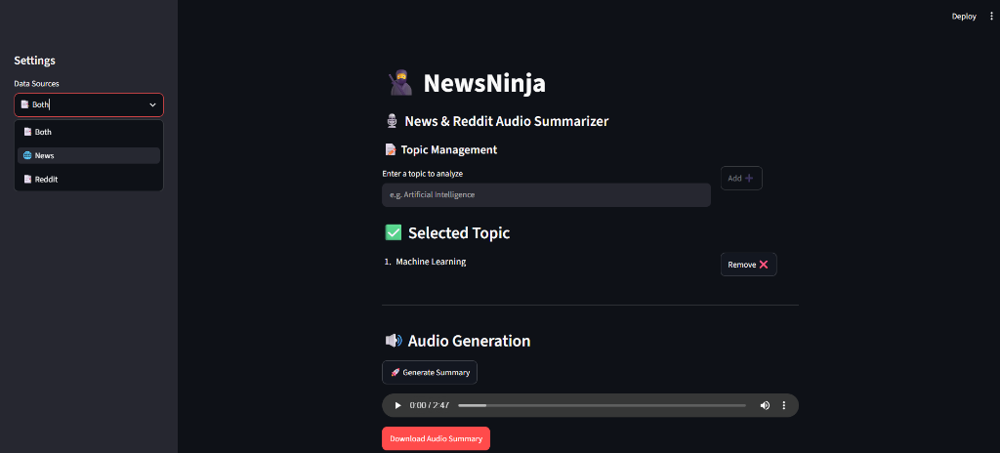
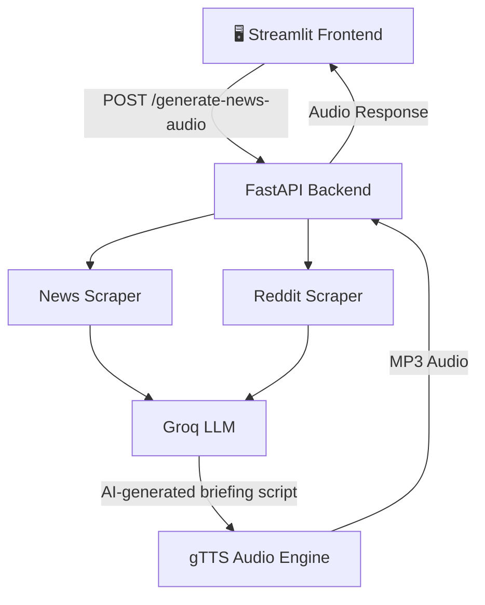

# 🎙️ InsightCast AI — News Intelligence & Audio Briefing Platform

InsightCast AI is an AI-powered news intelligence platform that aggregates recent news and Reddit discussions on user-selected topics, analyzes multi-source information using a large language model, generates a broadcast-ready briefing, and converts the result into downloadable audio.



---

## 🚀 Key Features

* **🌐 Real-Time News Aggregation:** Retrieves recent news related to user-selected topics using Firecrawl's search and scraping capabilities.

* **💬 Reddit Discussion Analysis:** Collects relevant Reddit discussions and extracts post content and community reactions using RSS-based ingestion.

* **🤖 AI-Powered News Synthesis:** Uses **Groq (`llama-3.3-70b-versatile`)** to combine information from multiple sources and generate concise, broadcast-style news briefings.

* **🎙️ Text-to-Speech Generation:** Converts AI-generated news scripts into downloadable MP3 audio using Google Text-to-Speech (`gTTS`).

* **⚡ Interactive Dashboard:** Provides a Streamlit-based interface for selecting topics, generating briefings, and accessing generated audio.

---

## 🛠️ Tech Stack

* **Frontend:** Streamlit
* **Backend:** FastAPI & Uvicorn
* **News Search & Scraping:** Firecrawl
* **Reddit Data:** Reddit RSS / Atom feeds
* **LLM:** Groq — Llama 3.3 70B
* **LLM Orchestration:** LangChain
* **HTML Processing:** BeautifulSoup4
* **Audio Generation:** gTTS
* **Data Validation:** Pydantic
* **Language:** Python

---

## 📁 Repository Structure

```text
├── assets/                  # Documentation assets & screenshots
├── backend.py               # FastAPI server and API endpoints
├── frontend.py              # Streamlit dashboard interface
├── models.py                # Pydantic data schemas
├── news_scraper.py          # News aggregation and scraping module
├── reddit_scraper.py        # Reddit search and RSS ingestion pipeline
├── utils.py                 # LLM prompts, processing utilities and TTS
├── Pipfile                  # Pipenv project dependencies
├── Pipfile.lock             # Locked dependency versions
├── .gitignore               # Files excluded from Git
└── README.md                # Project documentation
```

---

## 🔌 System Architecture & Workflow



### 🔄 Processing Workflow

1. **Topic Selection** — The user selects one or more topics from the Streamlit dashboard.
2. **News Collection** — Relevant news articles and headlines are retrieved through Firecrawl.
3. **Reddit Collection** — Relevant Reddit discussions are discovered and processed through RSS/Atom feeds.
4. **Content Processing** — Retrieved information is cleaned and structured for analysis.
5. **AI Synthesis** — Groq's Llama 3.3 model combines the collected information into a broadcast-style briefing.
6. **Audio Generation** — The generated script is converted into speech using gTTS.
7. **Briefing Delivery** — The resulting audio is made available through the Streamlit interface.

---

## 💬 Reddit RSS Processing

InsightCast AI uses Reddit RSS/Atom feeds to retrieve publicly available discussion content without relying on Reddit's developer API.

The workflow is:

1. Firecrawl identifies relevant Reddit discussion URLs.
2. The application accesses the corresponding RSS/Atom feed.
3. Python's XML parser processes the feed.
4. Post content and available discussion data are extracted.
5. The extracted information is passed to the AI synthesis pipeline.

This approach reduces dependency on Reddit API credentials for the discussion ingestion component.

---

## ⚙️ Installation & Setup

### 1. Clone the Repository

```bash
git clone https://github.com/SagarVB16/InsightCast-AI.git
cd InsightCast-AI
```

### 2. Install Dependencies

This project uses Pipenv.

```bash
pipenv install
```

### 3. Configure Environment Variables

Create a `.env` file in the root directory:

```env
FIRECRAWL_API_KEY=your_firecrawl_api_key_here
GROQ_API_KEY=your_groq_api_key_here
```

**Never commit your `.env` file or API keys to GitHub.**

### 4. Run the Backend API

Start the FastAPI backend:

```bash
pipenv run python backend.py
```

The backend runs on port `1234`.

### 5. Run the Streamlit Dashboard

Open a second terminal and run:

```bash
pipenv run streamlit run frontend.py
```

The Streamlit application will normally be available at:

```text
http://localhost:8501
```

---

## 🔐 Environment Variables

| Variable            | Purpose                                         |
| ------------------- | ----------------------------------------------- |
| `FIRECRAWL_API_KEY` | Accesses Firecrawl search and scraping services |
| `GROQ_API_KEY`      | Provides access to Groq's LLM API               |

Store these credentials only in your local `.env` file.

---

## 🎯 Project Objective

InsightCast AI aims to simplify information consumption by combining **multi-source data collection, AI-powered analysis, and text-to-speech generation** into a single workflow.

Instead of manually reading multiple news articles and online discussions, users can generate an AI-powered audio briefing for their selected topics.

---

## 👨‍💻 Technologies

**Python • FastAPI • Streamlit • Groq • Llama 3.3 • LangChain • Firecrawl • Reddit RSS • BeautifulSoup • gTTS • Pydantic**
